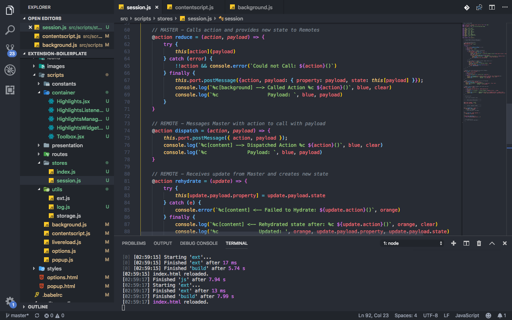

  <h1>
    TPOT Toolbox Extension 
  </h1>

  __A cross-browser extension platform that hosts multiple__
  __helpful utilities used by the PathofTruth community.__

  

## Getting Started

 > __*Welcome!*__ If have never used Toolbox, begin with [How to Install](#how-to-install) & [Basic Usage](#basic-usage). If you have already installed the extension to your browser(s), then check out the [Features](#features) section to see what tools you can enable and how to use them!

- [__What's New?__](#whats-new?)
- [__How to Install__](#how-to-install)
- [__Features__](#features)
  - [__What are Tools?__](#what-are-tools)
  - [__Settings__](#settings)
  - [__Highlighter__](#highlighter)
  - [__Scripture Versions__](#scripture-versions)
  - [__Email Sorting__](#email-sorting)
  - [__Letters__](#letters)
  - [__Bible Readings__](#bible-readings)
  - [__Music and Video__](#music-and-video)
- [__Advanced Stuff__](#advanced-stuff)
- [__How Can I Contribute?__](#how-can-i-contribute)
- [__Development__ [admins only]](#development)

## What's New?

[January 12, 2019]()
> Now that Firefox supports WebExtensions, it has become a lot easier to build browser extensions for multiple browsers without duplicating the code. We can now support [Firefox](#firefox-how-to), [Opera](#opera-how-to), and [Firefox Mobile](#firefox-mobile-how-to).
  - Toolbox now updated to support Firefox.
  - Support for Firefox Mobile and Opera will be added soon.

##### [[back to Main Menu]](#getting-started)

---

## How to Install

- [__What is an 'Extension'?__](#what-is-an-extension)
- [__Is it Safe?__](#is-it-safe)
- [__Installation__](#installation)
  - [__Can I use this on Mobile?__](#can-i-use-this-on-mobile)
  - [__What Browser do I have?__](#what-browser-do-i-have)
  - [__Chrome__](#install-on-chrome)
  - [__Firefox__](#install-on-firefox)
  - [__Opera__](#install-on-opera)
  - [__Android__](#install-on-firefox-for-android)
- [__Basic Usage__](#basic-usage)
  - [__Signing Into TPOT CLoud__](#signing-into-tpot-cloud)
  - [__Example: Adding a Highlight__](#example-adding-a-highlight)
- [__I Need Help...__](#i-need-help)

##### [[back to Main Menu]](#getting-started)

### What is an Extension?

An `extension` is an app that adds additional features to your `internet browser`. They make the user experience more helpful and enjoyable by accomplishing small tasks that would otherwise not be provided by your browser or the webpage you are visiting. A good example of what an `extension` is is [Grammarly](), which checks spelling as you type on a webpage.

> Although most browsers call these apps `extensions`, there are some like Firefox that call them `addons`. Both terms may be used interchangably.

TPOT Toolbox is an extension that adds some new [features]() for the webpages you already visit, like __thepathoftruth__, __facebook__, __gmail__, and others. One of first features we added was the abilty to highlight and save important quotes when you are visiting __thepathoftruth__. We will show you how to do this in just a moment in our [basic example]()

##### [[back to How to Install]](#how-to-install)

### __Is it safe?__

> "I heard on the news that browsers extensions are unsafe and are providing access to user's personal information and violating their privacy"

This is true! Every once in a while you hear of an exploit like this occuring. Sites like Facebook are unappologetically "sniffing" the other tabs you have open - looking for personal information to feed on. You can read about it [here]().

Ironically, there is a solution for this problem, an extension called [Facebook Container]() on the Firefox Store.

> "What is this happening and is there a solution?"

The problem is that in order for extensions to provide a better user experience, they may have to access bits of information while you are browsing. This may include reading text off the webpage you are visiting, managing your bookmarks and viewing your internet history. Providers like Chrome and Firefox have what is called an `API`, which is a bridge between your browser and the webpages you visit. 

The very good news is this `API` is limited. It can only do what it is programmed to do. When you install an extension, you will be prompted with the list of `permissions` that will be allowed by the user, similar to installing an app on iPhone or Android. Some of these `permissions` are optional and can be turned off at any time through [settings](). Others are required, but you have to give consent to allow the extension to use them.

> "What are you doing to ensure that my data privacy is respected"

We want to do the absolute best and nothing less when it comes to data privacy. Below is only part of what we are doing to ensure a totally safe and respectful browsing extension.

__Permissions__

- While developing Toolbox we have worked with only the minimum required permissions. As much as possible, we have tried to make certain permissions optional for the user, so that they are in full control of what the extension is allowed to do. But this is not extensionspecific, it is tool-specific. Certain tools will have access to different permissions. When you install Toolbox, you are not required to enable every tool. So you control what is enabled and what is not. You can control this in your settings page, which will tell you what each extension is allowed to do. You are in control.

__Content Security Policy__

- CSP's restrict a website or extension from loading content (script, images, video) from unapproved sources. Everything in Toolbox is locked down so that resources that are needed can only be loaded from an internal whitelist. All of these connections are secured via HTTPS and are 256 bit encrypted. No script is evaluated directly, but its origin is verified before it is ever ran. This protects you from malicious sites that may try to access your data.

__"Sniffing"__

- Unlike Facebook, we don't sniff the other tabs that are in your browser. This is actually tedious to do through the `api` as it is.

__TPOT Cloud User Data__

- When you [sign in for the first time](), you will create a new account for TPOT Cloud. This is a secure platform hosted by [Firebase](). It allows Toolbox to keep your settings synced between devices and store information that you have requested (like page highlights and notes). This data is only accessable to you through Toolbox when you are signed in. Nobody else can see it or download it without your credentials.

- When you [create and account]() through Toolbox, you can sign up using another provider like Facebook. This login information is not visible and is encrypted.

- Your user password is not even visible to TPOT Cloud, so when you are resetting or changing your password, it is not done by the system admin. You are totally secure.

Most importantly, we offer TPOT Toolbox [open-source](), which means you can see all the code that was used to build the extension for yourself. We want you to be in the look and know exactly what you are installing on your system and how it affects your privacy.

Since we are offering the codebase for free, if anyone feels like making a [contribution]() themselves, making a [suggestion for a new feature](), or [reporting an issue]() - we would really appreacite it.

##### [[back to How to Install]](#how-to-install)

---

### Installation

> If you aren't the most tech-savy person on the planet, then start with [What Browser do I have?](). Otherwise, if you already know what browser you have and are ready to install, then click on the appropriate link below.

  - [__Chrome__](#install-on-chrome)
  - [__Firefox__](#install-on-firefox)
  - [__Opera__](#install-on-opera)

### What Browser do I Have?

Hopefully you already know this, but if you don't, don't worry! We have a solution for non-tech savy people! Click on [this link]() to find out what browser you are running (Chrome, Firefox, Opera, Safari, Edge, Internet Explorer), and then [scroll up a bit]() to see if we have an installation guide Toolbox available for your browser.

### Can I use this on Mobile?

Normally you would not be able to use extensions like Toolbox on your mobile device. Recently Firefox's mobile browser [Firefox for Android]() added support for browser extensions, but they are limited in what they can do. You can see how install Toolbox for Android and what features we have been able to port over to Firefox.

  - [__Install Toolbox on Firefox for Android__](#install-on-firefox-for-android)

##### [[back to How to Install]](#how-to-install)

---

### Install on Chrome

1. Find Toolbox extension on the Chrome Webstore here:[https://chrome.google.com/webstore/category/extensions](https://chrome.google.com/webstore/category/extensions)

2. Click `Add to Chrome`

3. If your recieve a prompt for __Add "Toolbox"__ then click `Add Extension`

You should now see a little button in your top toolbar with a red toolchest icon. You may also be navigated to another tab with a welcome screen and a login screen. Congradulations! You have installed Toolbox sucessfully. You are now ready to move onto the next step:

[Basic Usage]()

> If you weren't able to install the extension or something strange has happened let us know that you [need help](#i-need-help)!

##### [[back to How to Install]](#how-to-install)

---

### Install on Firefox

##### [[back to How to Install]](#how-to-install)

---

### Install on Opera

##### [[back to How to Install]](#how-to-install)

---

### Install on Firefox for Android

##### [[back to How to Install]](#how-to-install)

---

### Basic Usage

##### [[back to How to Install]](#how-to-install)

### Signing into TPOT Cloud

##### [[back to How to Install]](#how-to-install)

### Example: Adding a Highlight

##### [[back to How to Install]](#how-to-install)

### I Need Help...

##### [[back to How to Install]](#how-to-install)

<dl>
  <dt>Platform specific & Environment specific variables.</dt>
  <dd>
    You might need to specify different data variables based on your environment. For example, you might want to use a localhost API endpoint during development and a production API endpoint once the extension is submitted to the appstore. You can specify such data in the json files inside `config` directory.

    You can also set custom data variables based on the platform (different variable for Chrome, FF, Opera).
  </dd>
</dl>

## Installation
1. Clone the repository `git clone https://github.com/EmailThis/extension-boilerplate.git`
2. Run `npm install`
3. Run `npm run build`

Alternately, if you want to try out the sample extension, here are the download links. After you download it, unzip the file and load it in your browser using the steps mentioned below.
 - [__Download Chrome Extension__](https://github.com/EmailThis/extension-boilerplate/releases/download/v1.0/chrome.zip)
 - [__Download Opera Extension__](https://github.com/EmailThis/extension-boilerplate/releases/download/v1.0/opera.zip)
 - [__Download Firefox Extension__](https://github.com/EmailThis/extension-boilerplate/releases/download/v1.0/firefox.zip)

##### Load the extension in Chrome & Opera
1. Open Chrome/Opera browser and navigate to chrome://extensions
2. Select "Developer Mode" and then click "Load unpacked extension..."
3. From the file browser, choose to `extension-boilerplate/build/chrome` or (`extension-boilerplate/build/opera`)

##### Load the extension in Firefox
1. Open Firefox browser and navigate to about:debugging
2. Click "Load Temporary Add-on" and from the file browser, choose `extension-boilerplate/build/firefox`

## Developing
The following tasks can be used when you want to start developing the extension and want to enable live reload - 

- `npm run chrome-watch`
- `npm run opera-watch`
- `npm run firefox-watch`

## Packaging
Run `npm run dist` to create a zipped, production-ready extension for each browser. You can then upload that to the appstore.

## TODO
- [ ] Add support for Safari
- [x] Add Firefox & Opera Promo images
- [x] Add sample screenshot templates
- [ ] Write a guide for using config variables & JS preprocessor

-----------
This project is licensed under the MIT license. 

If you have any questions or comments, please create a new issue. I'd be happy to hear your thoughts.

Bharani, [Email This](https://www.emailthis.me)
